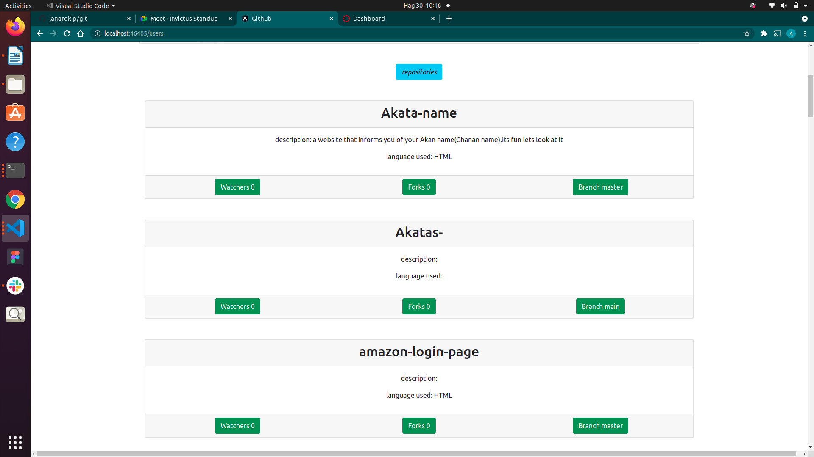
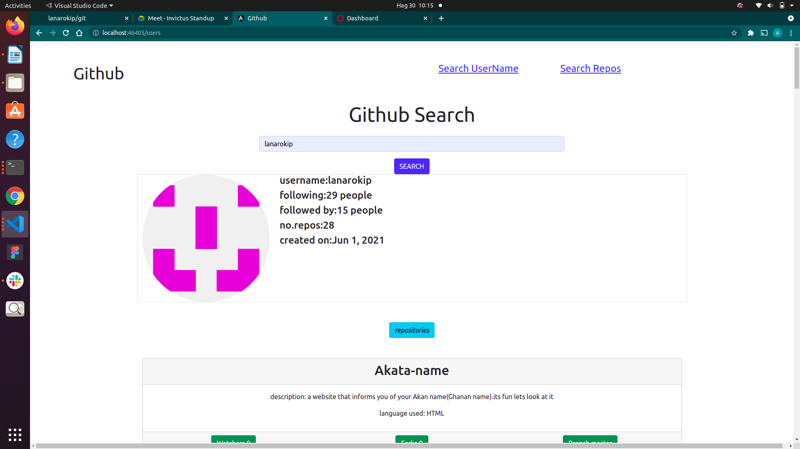

# QuotesApp
## About the Author
Developed by Aron kipkoech langat on 29rd August 2021.
## Description
this an app that uses the github Api so as to make the repositories and a persons profile easily
## Setup/Installation Requirements
Requirements:
    <ul>
        <li>Git</li>
        <li>Github</li>
        <li>Web browser</li>
        <li>A text editor</li>
        <li>Angular</li>
    </ul>
Fork or clone the repository using the below provided link 
https://github.com/lakipkoecharo/Quotes- 
Run `ng serve` for a dev server. Navigate to `http://localhost:4200/`. The app will automatically reload if you change any of the source files.
## Technologies Used
The following languages have been used to develop the project
    <ol>
        <li>HTML</li>
        <li>CSS</li>
        <li>Javascript</li>
        <li>Bootsrap</li>
        <li>Angular framework</li>
    </ol>
## Live link
Here's the link to the project's [https://lanarokip.github.io/git/]
### Bugs
No bugs have been identified in the project.
### Contact information
cell:  +254705378641
Mail: lankipkoecharo@gmail.com
### License
[License](./license)
### The App screenshots

